[`PostgreSQL Avanzado`](../README.md)

# Sesión 01: Introducción a PostgreSQL

## 🌿 Introducción

PostgreSQL es uno de los sistemas de gestión de bases de datos relacional y objeto-relacional más avanzados y robustos disponibles en la actualidad. Esta sesión ofrece una introducción detallada a PostgreSQL, cubriendo su historia y evolución, características y ventajas, y los diversos casos de uso y aplicaciones en diferentes sectores.

## 🎯 Objetivos Generales

1. Comprender la historia y evolución de PostgreSQL.
2. Conocer las características y ventajas que distinguen a PostgreSQL de otros sistemas de bases de datos.
3. Identificar los casos de uso y aplicaciones en los que PostgreSQL es particularmente efectivo.

## 📚 Temario

1. **Historia y Evolución de PostgreSQL**
    - Orígenes y desarrollo
    - Versiones importantes

2. **Características y Ventajas de PostgreSQL**
    - Sistema de gestión de bases de datos relacional y objeto-relacional
    - Extensibilidad y estándares

3. **Casos de Uso y Aplicaciones**
    - Sectores de uso
    - Escenarios de aplicación

## 🚀 Desarrollo

---

<details><summary><h3>Historia y Evolución de PostgreSQL</h3></summary>
<br/>

#### Orígenes y Desarrollo

PostgreSQL tiene una rica historia que se remonta a la década de 1980. Comprender sus orígenes y desarrollo ayuda a apreciar su robustez y capacidad actual.

- **Inicios**: Comenzó como el proyecto POSTGRES en la Universidad de California, Berkeley, dirigido por el profesor Michael Stonebraker en 1986.
- **Evolución a PostgreSQL**: En 1996, el proyecto fue renombrado a PostgreSQL para reflejar su soporte para SQL (Structured Query Language).
- **Desarrollo Comunitario**: PostgreSQL es desarrollado y mantenido por una comunidad global de desarrolladores y colaboradores.

#### Versiones Importantes

PostgreSQL ha tenido numerosas versiones, cada una introduciendo nuevas características y mejoras significativas.

- **PostgreSQL 7.0 (2000)**: Introdujo WAL (Write-Ahead Logging) para mejorar la recuperación y confiabilidad.
- **PostgreSQL 9.0 (2010)**: Introdujo la replicación en caliente y el soporte para "hot standby".
- **PostgreSQL 10 (2017)**: Introdujo la partición nativa de tablas y mejoras en la replicación lógica.
- **PostgreSQL 13 (2020)**: Mejoras significativas en el rendimiento de la indexación y el paralelismo en la ejecución de consultas.
- **PostgreSQL 16 (2023):** Introdujo mejoras en la ejecución de consultas paralelas, soporte mejorado para JSON, y optimizaciones adicionales en el rendimiento de la base de datos.


<br/>
</details>

---

<details><summary><h3>Características y Ventajas de PostgreSQL</h3></summary>
<br/>

#### Sistema de Gestión de Bases de Datos Relacional y Objeto-Relacional

PostgreSQL combina características de bases de datos relacionales y objeto-relacionales, lo que le confiere una gran flexibilidad y poder.

- **Relacional**: Soporte completo para ACID (Atomicidad, Consistencia, Aislamiento, Durabilidad) y consultas SQL avanzadas.
- **Objeto-Relacional**: Soporte para tipos de datos personalizados, tablas herederas, y otras características avanzadas de bases de datos objeto-relacionales.

#### Extensibilidad y Estándares

PostgreSQL es altamente extensible y cumple con muchos estándares de bases de datos, lo que lo hace ideal para una amplia gama de aplicaciones.

- **Extensibilidad**: Soporte para extensiones, funciones definidas por el usuario, y tipos de datos personalizados.
- **Estándares**: Cumplimiento con los estándares SQL:2011 y soporte para lenguajes procedurales como PL/pgSQL, PL/Tcl, PL/Perl, y PL/Python.

<br/>
</details>

---

<details><summary><h3>Casos de Uso y Aplicaciones</h3></summary>
<br/>

#### Sectores de Uso

PostgreSQL es utilizado en una variedad de sectores gracias a su robustez, flexibilidad y características avanzadas.

- **Finanzas**: Bancos y instituciones financieras utilizan PostgreSQL por su seguridad y capacidades transaccionales.
- **Tecnología de la Información**: Empresas tecnológicas utilizan PostgreSQL por su rendimiento y escalabilidad.
- **Gobierno**: Organismos gubernamentales aprecian PostgreSQL por su cumplimiento con estándares y su costo-efectividad.

#### Escenarios de Aplicación

Los escenarios de aplicación de PostgreSQL son diversos y abarcan desde sistemas de gestión de contenidos hasta análisis de datos a gran escala.

- **Sistemas de Gestión de Contenidos**: Utilizado para gestionar grandes volúmenes de contenido en sitios web y aplicaciones.
- **Análisis de Datos**: Utilizado para análisis y minería de datos gracias a sus capacidades avanzadas de consulta y extensibilidad.
- **Aplicaciones Web**: Utilizado como backend para aplicaciones web debido a su fiabilidad y soporte para múltiples conexiones concurrentes.

<br/>
</details>

---

### 💯 Conclusión

PostgreSQL es una opción poderosa y flexible para la gestión de bases de datos, con una historia rica y un desarrollo constante que lo mantiene a la vanguardia de la tecnología de bases de datos. Su combinación de características relacionales y objeto-relacionales, junto con su extensibilidad y cumplimiento de estándares, lo hacen ideal para una amplia gama de aplicaciones y sectores. Este curso avanzado proporciona una sólida introducción a PostgreSQL, preparando a los participantes para aprovechar al máximo sus capacidades en entornos de producción complejos y exigentes.

### 🤓 Proyecto Modular

---

<details><summary><h3>Creación de un Repositorio</h3></summary>
<br/>

Con el fin de que puedas poner todo tu conocimiento en práctica a lo largo de este módulo se realizarán distintas actividades que te permitirán ir construyendo un proyecto de manera progresiva y de manera guiada por los expertos. Este proyecto será el entregable final de todo del módulo y se dividirá en las siguientes etapas:

- [ ] Creación de un repositorio   
- [ ] Obtención de datos   
- [ ] Configuración del entorno SQL   
- [ ] Diseño de la base de datos
- [ ] Gestión de usuarios
- [ ] Creando una copia de seguridad
- [ ] Optimizando consultas
- [ ] Preparando un proceso de réplica y alta disponibilidad
- [ ] Preparando el monitoreo
- [ ] Migración de datos
- [ ] Presentación del proyecto

---
 
#### :dart: Avance del Proyecto 1/10: Creación de un repositorio

En esta primera sesión te orientaremos en la creación de un repositorio para que puedas alojar tu proyecto y lo presentes en la sesión final del módulo. 

⏰ Tiempo estimado: *60 minutos*

**Paso 1: Configura una cuenta en GitHub en caso de que no tengas una**

1. Ingresa a la página [https://github.com/](https://github.com/).

   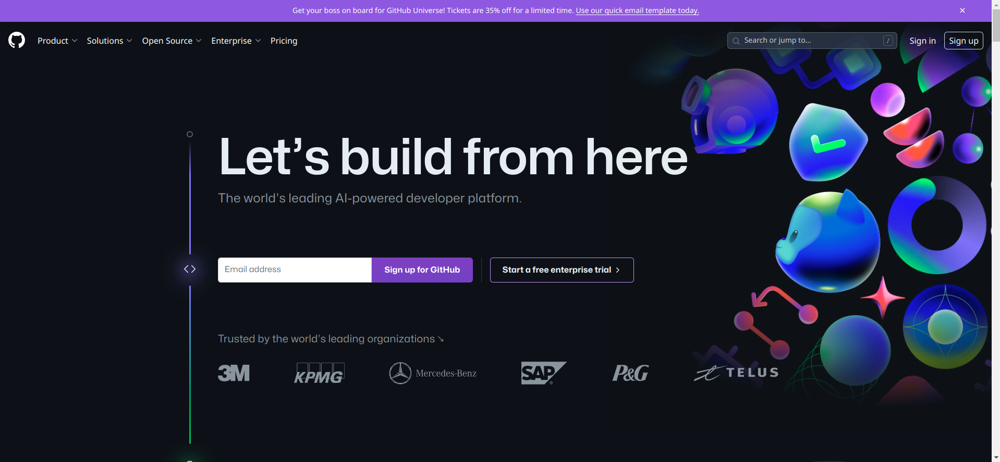

2. Da clic en el botón que se encuentra en la esquina superior derecha `Sign Up`.

   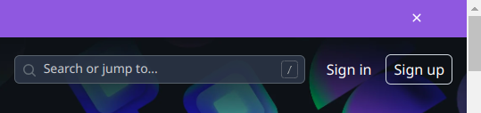

3. Coloca los datos que se solicitan y ve presionando el botón `Continue`.

   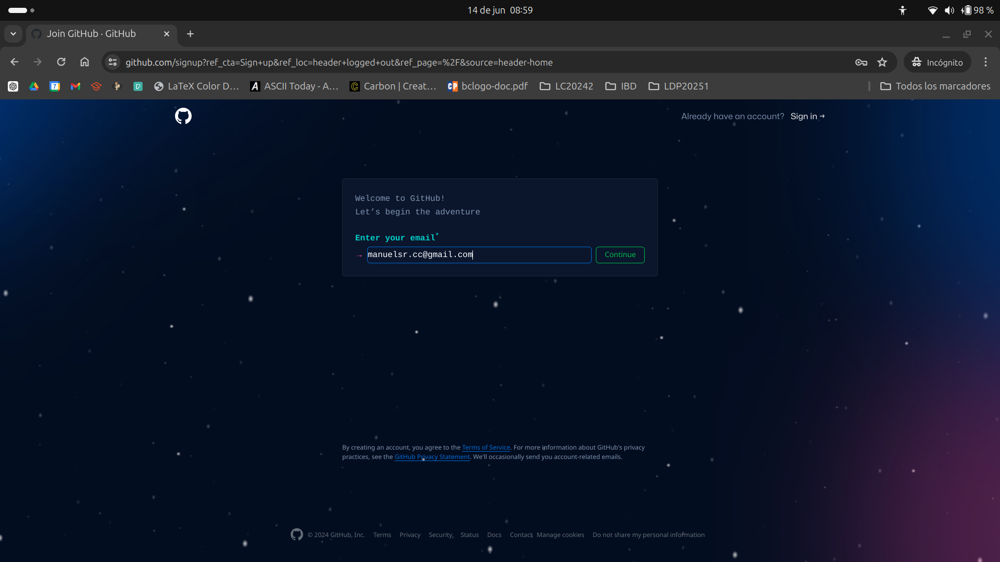

   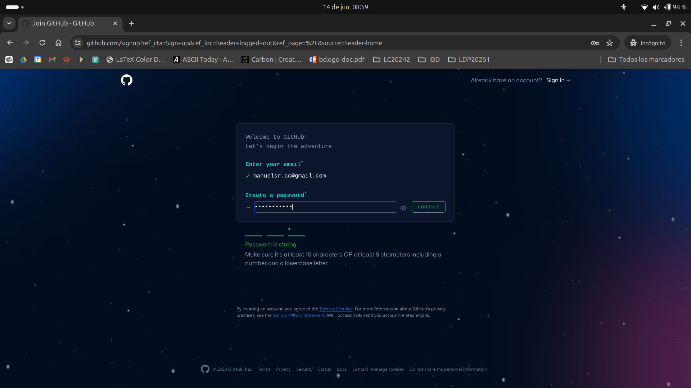

   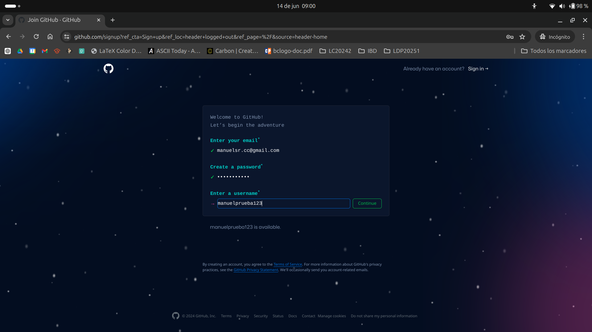

   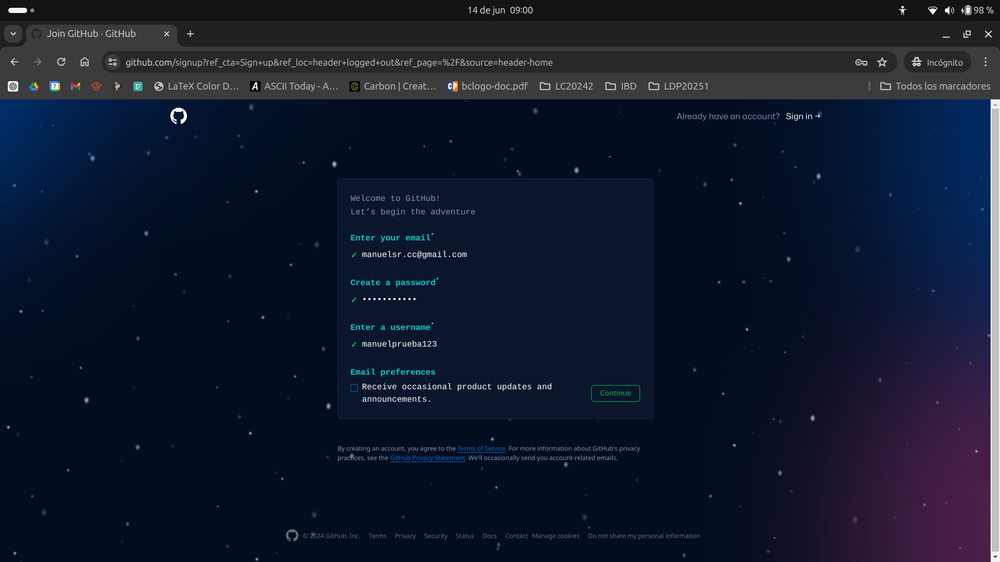

4. Verifica tu cuenta resolviendo el acertijo.

   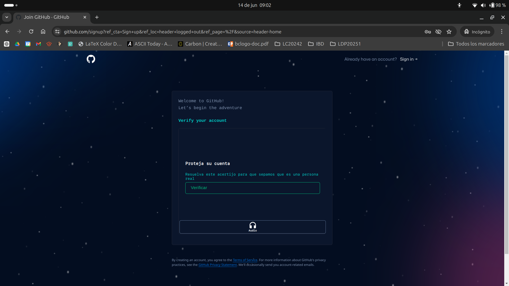

5. Se enviará un correo a tu cuenta para confirmala, coloca el código.

   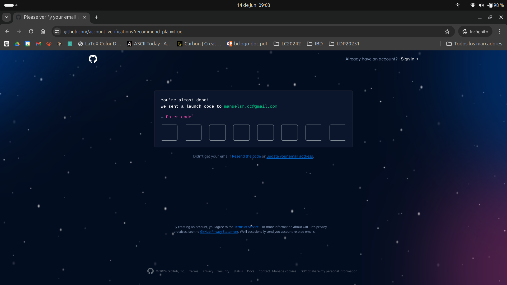

6. Inicia sesión con los datos que acabas de configurar.

   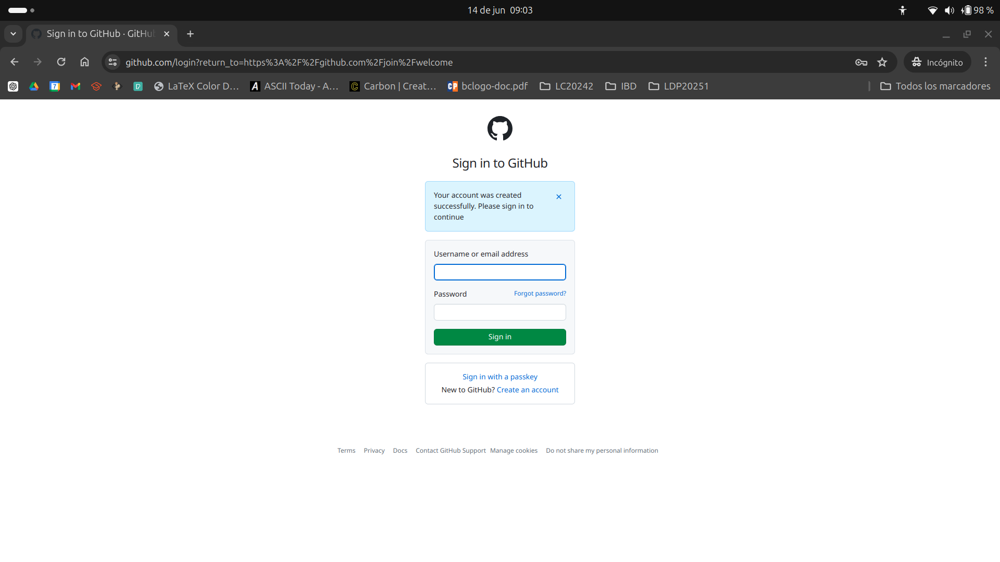

7. Contesta la encuesta de inicio o elige `Skip personalization`

   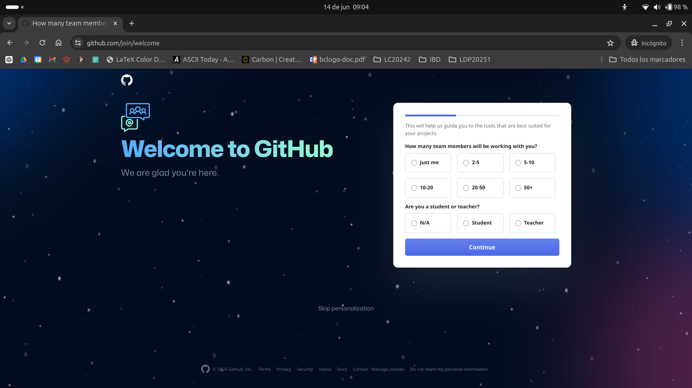

**¡Con esto tienes tu cuenta lista!**


**Paso 2: Instala Git en tu computadora**

1. Ingresa a la página [https://www.git-scm.com/downloads](https://www.git-scm.com/downloads).

   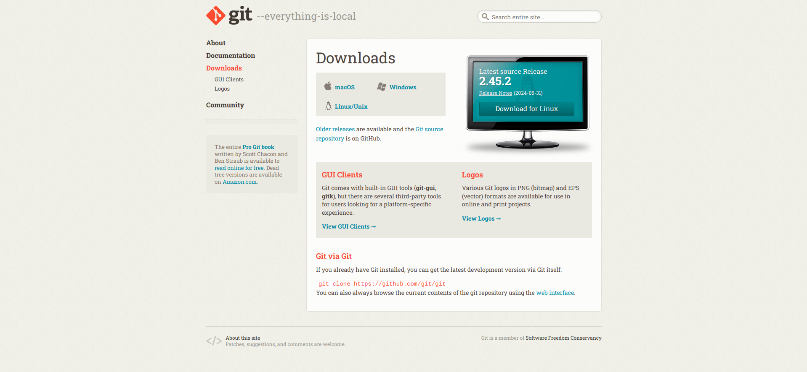

2. Elige tu sistema operativo y sigue el tutorial según corresponda.

   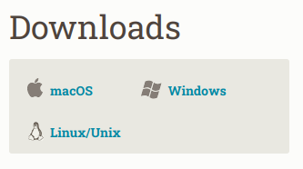

**Paso 3: Crea una estructura de carpetas en tu equipo**


Configura en tu equipo una estructura de carpetas, donde desees colocar el proyecto. En esta estructura se irán creando las soluciones a las distintas actividades que realizaremos a lo largo del módulo, de momento, la estructura de tu carpeta queda libre, pero poco a poco iremos estandarizando su contenido.


**Paso 4: Añade un archivo `README.md` en blanco**


Dentro de la siguiente [liga](plantilla/README.md) encontrarás un documento en formato **Markdown** puedes utilizarlo para ir generando una pequeña documentación sobre tu proyecto. De momento basta con que coloques datos básicos y lo iremos completando poco a poco a lo largo del resto de sesiones.

Adicionalmente te dejamos la documentación de **Markdown** para que aprendas un poco más de este lenguaje de marcado:

🔗 [Sintaxis de escritura y formato básicos
](https://docs.github.com/es/get-started/writing-on-github/getting-started-with-writing-and-formatting-on-github/basic-writing-and-formatting-syntax)


**Paso 5: Empuja (`push`) los datos al repositorio de GitHub**

Para poder realizar `push` en un repositorio de GitHub, necesitamos primero contar con un *token* de acceso, para obtenerlo dirígete a la página: [https://github.com/settings/tokens](https://github.com/settings/tokens).

Una vez configurado el *token*, usa la terminal de Git para dirigirte a la ruta de carpetas que configuraste. Para subir tus cambios siempre deberás colocar los siguientes comandos:

*Agregar los archivos modificados*

```bash
> git add .
```

*Confirmar los cambios*

```bash
> git commit -m "Primer commit"
```

*Empujar los cambios*

```bash
> git push origin main
```

Una vez hecho esto, puedes ingresar a GitHub y ver tus cambios.


---

#### :rocket: Tu avance: <progress max="100" value="9">9%</progress>

- [x] Creación de un repositorio 


</details>

---

[`< Regresar`](../README.md)

