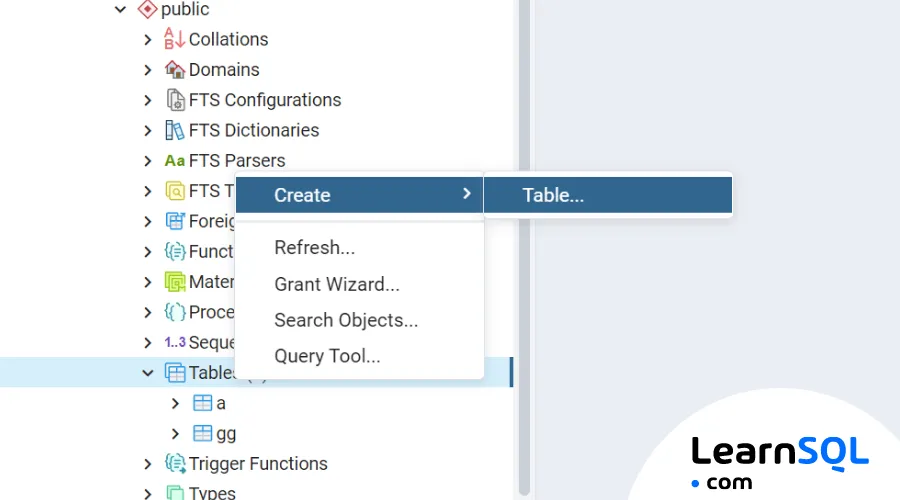
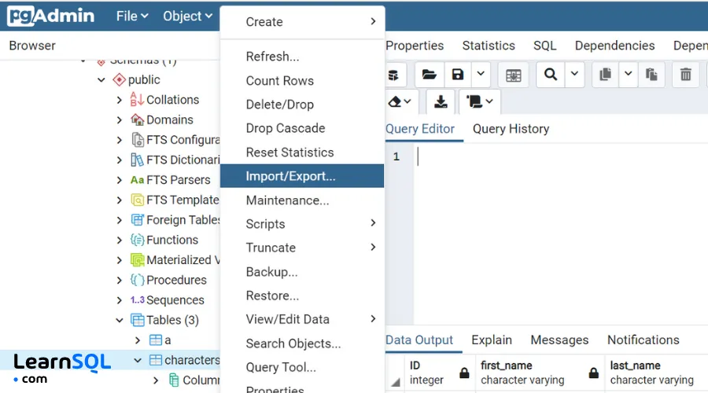
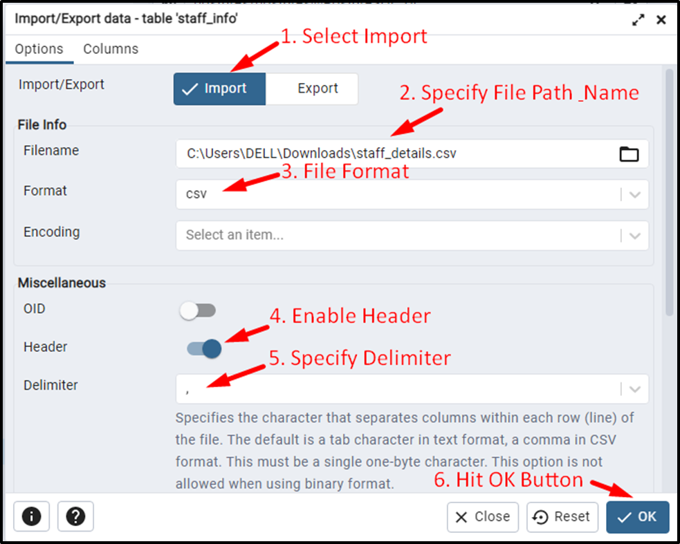
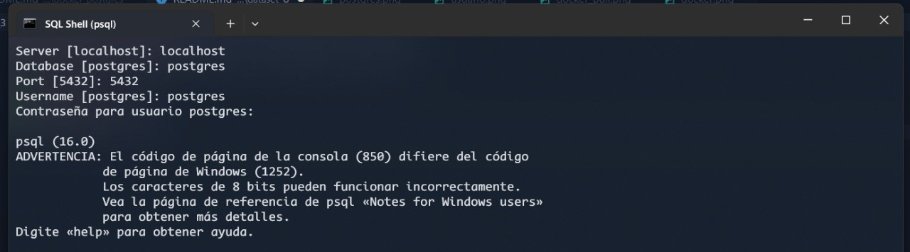
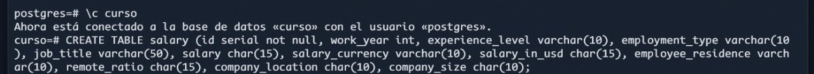
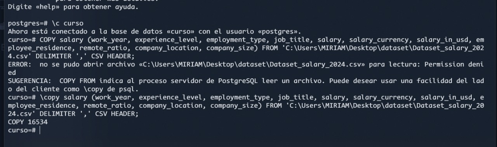

# Importando Datos desde CSV
Vamos a importar un dataset previamente descargado en formato CSV

#### Importando
Hay 2 métodos y uno de ellos es mediante pgAdmin, veamos el proceso

1. Debemos abrir pgAdmin
2. Seleccionar la base de datos en la que vamos a importar los datos
3. Crear la tabla con los respectivos campos a importar

4. En la pestaña "Tools" seleccionar "Import/Export Data"
5. Seleccionar "Import" y elegir el archivo CSV

6. Seleccionar el delimitador (en este caso coma) y el carácter de texto (en este caso doble comillas)

7. Seleccionar la tabla destino y el tipo de datos 
8. El proceso ha sdio satisfactorio

El otro método es mediante Terminal / Consola de Comandos

1. Abrir psql y proporcionar los datos que solicita

2. Acceder a la Base de datos
3. Crear la tabla para la importación de datos

4. Copiar los datos desde el archivo
5. Se han copiado perfectamente

