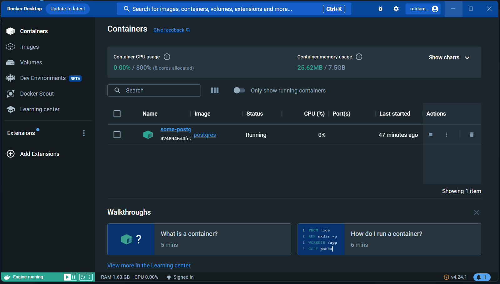
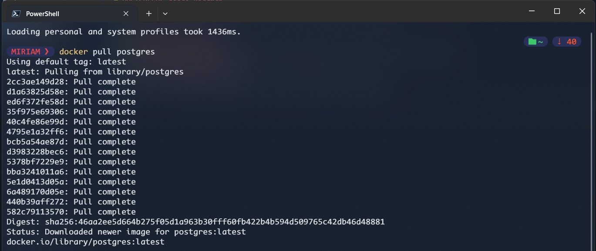
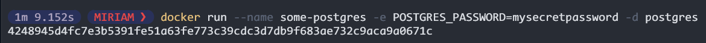
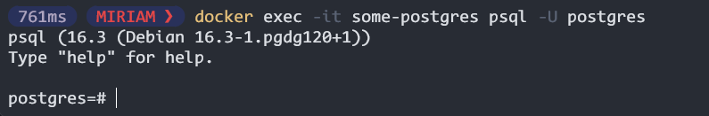

# POSTGRESQL desde Roadmap

Podemos generar una imagen mediante Docker y aquí les doy un ejemplo.

#### PostgreSQL con Docker
1. Tener instalado Docker, una cuenta en DockerHub, iniciar sesión e iniciar Cocker

2. Escribir el siguiente comando en Terminal `docker pull postgres`

3. Ahora crearemos un usuaio y contraseña para acceder a Postgres

4. Ahora ejecutamos por el nombre y usuario

### COMANDOS DE DOCKER

Los primeros comandos son los más comunes

| Comandos | Descripción |
| --- | --- |
| docker pull | Descarga la imagen de DockerHub |
| docker run | Inicia un contenedor a partir de una imagen |
| docker ps | Muestra los contenedores en ejecución |
| docker stop | Detiene un contenedor |
| docker rm | Elimina un contenedor |
| docker exec | Ejecuta un comando en un contenedor en ejecución |

Aquí les dejo los que utilizamos para eliminar el de hoy 18 de Junio
| Comandos | Descripción |
| --- | --- |
| docker images prune  | Eliminar las imágenes colgantes |
| docker system prune -a | Elimina todas las imágenes no utilizadas |
| docker images | Verifición de imágenes en caso de tener en segundo plano |