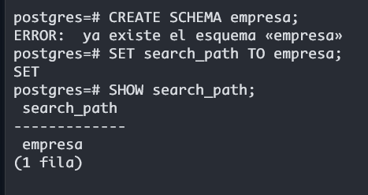
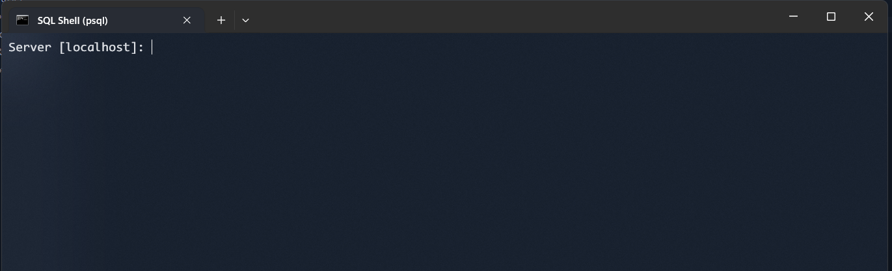
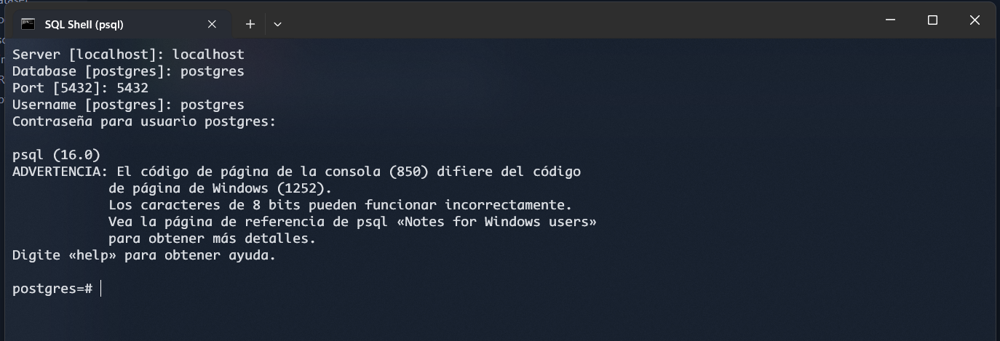
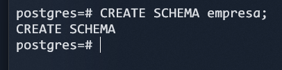
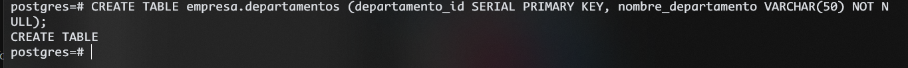
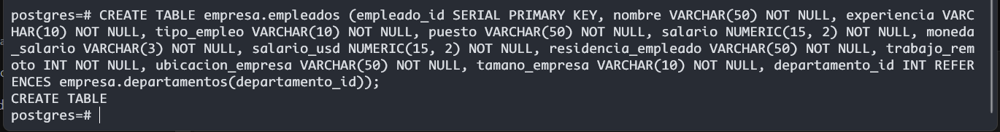
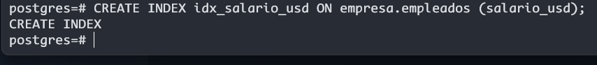
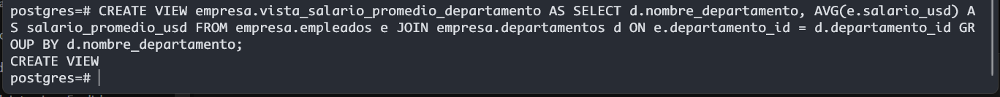

# Creación de esquemas desde PSQL

Para este ejercicio abrimos nuestra terminal de PSQL

#### Pasos a seguir:
1. Accederemos a nuestra servidor base de Postgres

2. Crearemos un esquema

3. Una vez creado, podemos crear la tabla o tablas que se requieran:

4. Creamos un índice

5. Creamos una Vista para acceder a datos complejos

