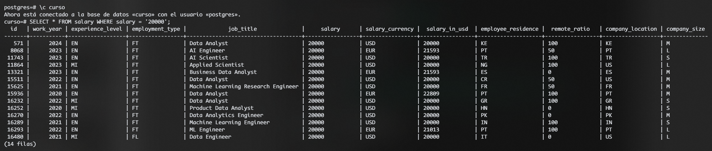
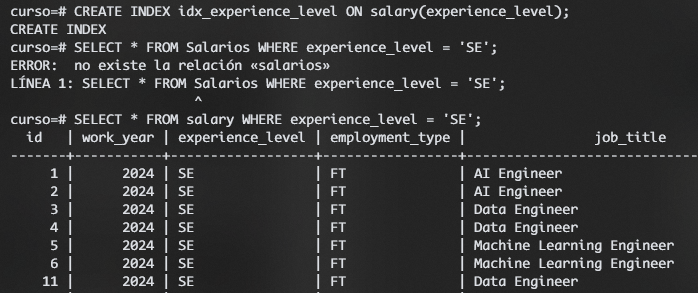
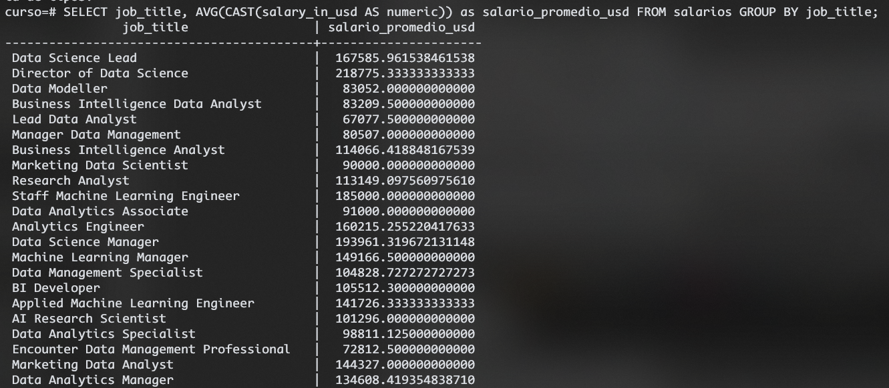
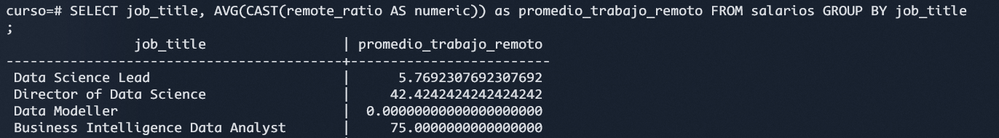
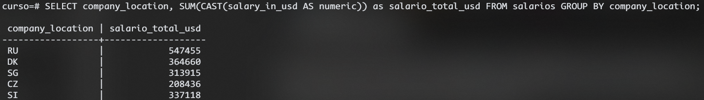
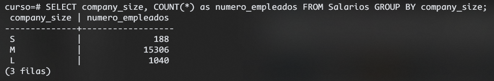

# Ejemplo de Obtención de Datos

Para este pequeño ejemplo, tomaremos los datos de la tabla salarios en la que nos muestre los salarios igual a 20'000, podemos hacer más pruebas con otros atributos

Creamos un index para poder utilizarlo. Los índices en una base de datos se utilizan para mejorar la velocidad de las consultas en columnas específicas.

Ahora una consulta con AVG y conversion

