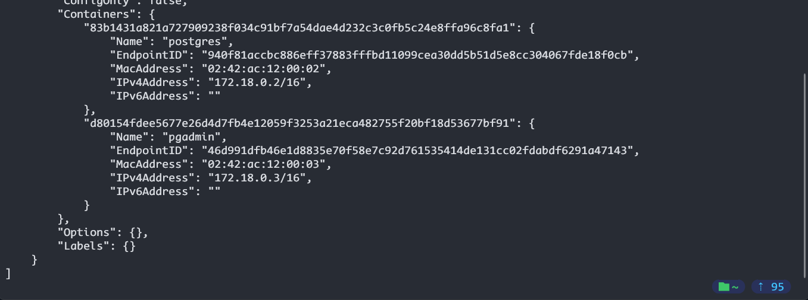
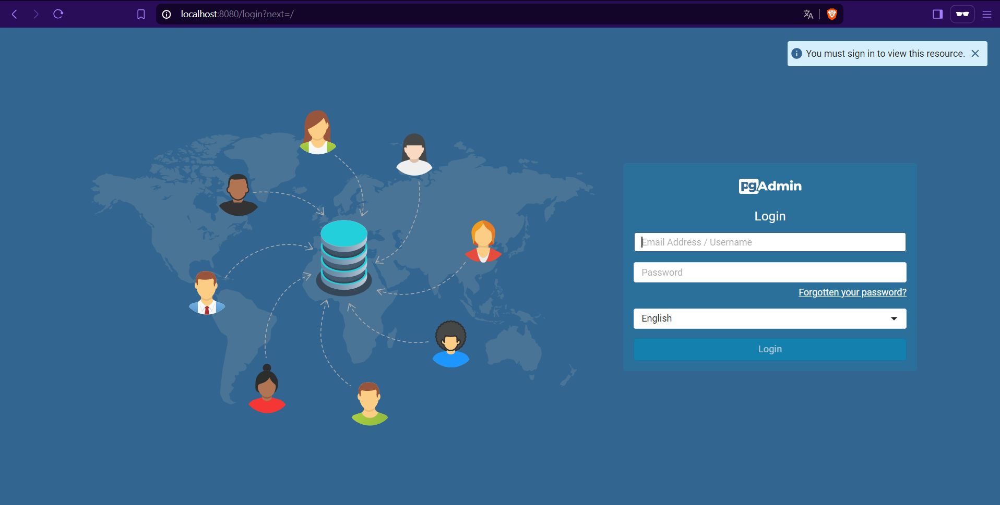
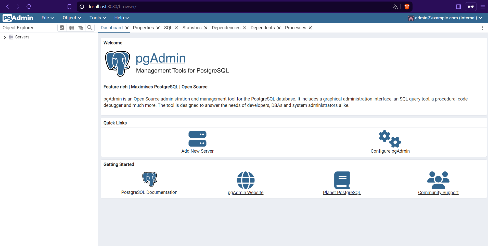
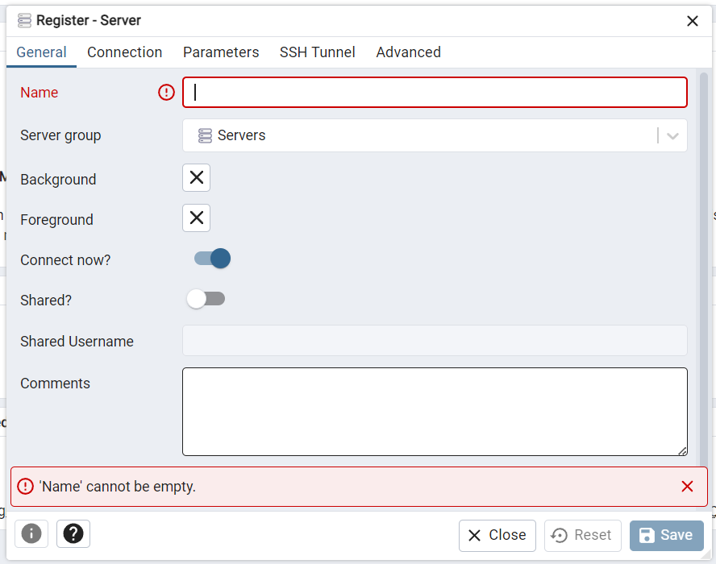
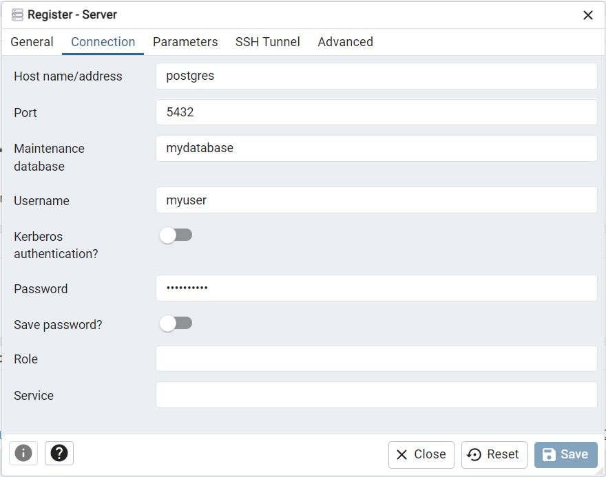
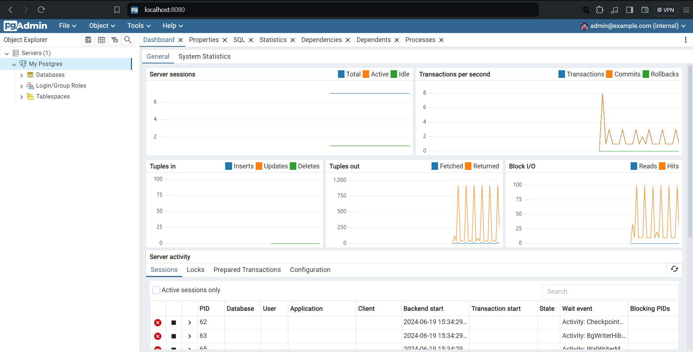

# Cómo conectar pgAdmin y PostgreSQL desde Docker

En este README veremos como conectar pgAdmin y PostgreSQL con Docker

## Requisitos previos
* Docker instalado en tu máquina
* Conocimientos básicos de Docker y PostgreSQL

## Pasos a seguir

1. Abrir una terminal de PowerShell y ejecutar el siguiente comando:
`docker network create mynetwork`
Este comando crea una red llamada "mynetwork" que se utilizará para conectar los contenedores de PgAdmin y PostgreSQL

2. Ahora vamos a ejecutar el comando para iniciar la imagen de Docker con PostgreSQL
`docker run -d --name postgres --network my_network -e POSTGRES_USER=myuser -e POSTGRES_PASSWORD=mypassword -e POSTGRES_DB=mydatabase -v postgres-data:/var/lib/postgresql/data -p 5432:5432 postgres:latest`
Este comando crea un contenedor llamado "postgres" que se ejecuta en segundo plano (-d), se une a la red "mynetwork" y se configura con las variables de entorno para el usuario, contraseña y base de datos

3. Ahora accederemos a la imagen de PgAdmin para conectar con PostgreSQL
`docker run -d --name pgadmin --network my_network -e PGADMIN_DEFAULT_EMAIL=admin@example.com -e PGADMIN_DEFAULT_PASSWORD=admin -p 8080:80 dpage/pgadmin4:latest`
Este comando nos permite al igual que el anterior conectarse a la red que habíamos creado anteriormente y poder acceder sin problemas, al igual tenemos usuario y contraseña

4. Ahora verificamos si tenemos ambos contenedores en la red, podremos verlos en la sección de containers
`docker network inspect my_network`

Y si ambos están en la red, podremos acceder a ellos sin problema. 

5. Ahora en una pestaña del navegador accederemos a PgAdmin, así que en la barra del navegador escrobimos lo siguiente: 
`localhost:8080` y veremos algo así:

6. Hacemos logion con los datos que escribimos en el paso 3, usuario: admin@example.com y contraseña: admin, lo que en automático nos permite acceder:

7. Ahora podemos crear nuestro server, por las configuraciones que hicimos vamos asignando los nombres para nuestro server.
 el nombre del server será: My Postgres para este caso.

8. Ahora la otra parte de la configuración, en este caso el host, el nombre de la base de datos, el usuario y la contraseña. 
 la contraseña será: mypassword, es la que asignamos previamente. 

9. Ahora si creado el servidor, veremos algo así: 

Con esto podemos ver que hemos conectado a PgAdmin desde Docker y conectando desde nuestro localhost y podemos acceder a el desde cualquier otro dispositivo en la misma red

---
**Recuerda que es importante cambiar las contraseñas y usuarios por seguridad**
