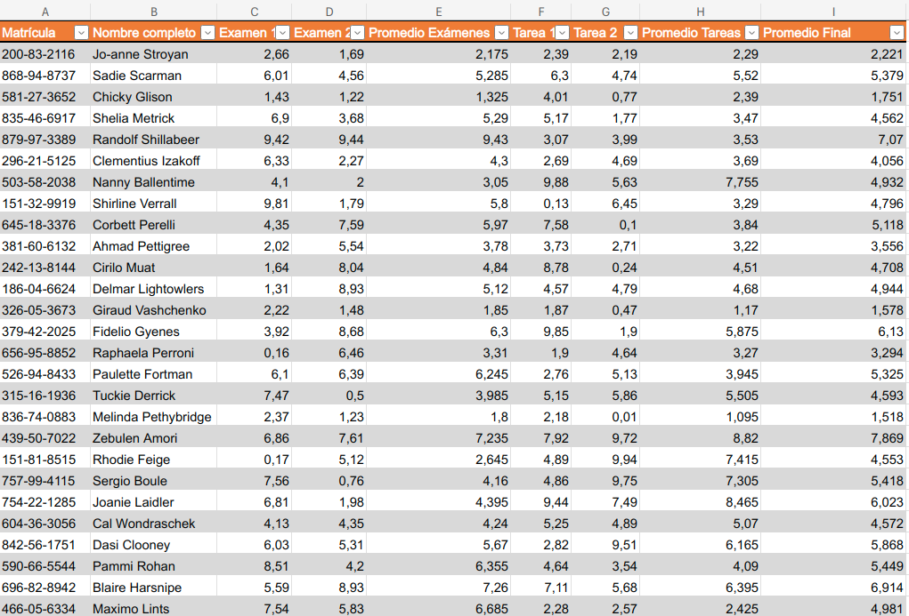

[`PostgreSQL Avanzado`](../../README.md) > [`Sesión 06`](../README.md)

### 🧠 Nuestro primer círculo de estudio

Te damos la bienvenida a nuestro primer círculo de estudio. En este círculo de estudio:

- Resolveremos todas las dudas que tengas en este momento sobre alguno de los temas que hemos abordado:

   :star: Introducción a PostgreSQL   
   :star: Arquitectura y Componentes Internos de PostgreSQL   
   :star: Herramientas y Utilidades (PSQL & PgAdmin 4)   
   :star: Diseño de Bases de Datos en PostgreSQL      
   :star: Gestión de Usuarios, Seguridad y Privilegios

- Para aesgurarnos de que domines los temas anteriores resolveremos paso a paso un miniproyecto. Aunque en la actividad te iremos guiando paso a paso sobre lo que tienes que hacer, será importante que lo consideres como un reto y que preguntes todas las dudas que tengas.

- También exploraremos uno que otro tema extra para completar tu formación del módulo. :heart:

#### Diseño de una base de datos para calificaciones

**Problema**: El profesor de una universidad tiene las calificaciones de las personas inscritas en su curso y quiere pasar los datos a una base de datos **PostgreSQL** para poderlo manipular de forma sencilla por medio de **SQL**.

El archivo se encuentra en una hoja de cálculo con la siguiente estructura:

 

Puedes descargar la hoja de cálculo aquí: [Calificaciones.xlsx](../archivos/Calificaciones.xlsx)

Los retos que deberás cumplir para completar este proyecto son:

1. [**`Reto 01`**](reto01/README.md): Diseñar la base de datos siguiendo un enfoque relacional. Esto lo puedes hacer aplicando las formas normales. Puedes añadir columnas a la hoja de cálculo si lo consideras necesario.

2. [**`Reto 02`**](reto02/README.md): Crear las tablas necesarias para cargar la información. Esto lo puedes hacer usando el comando `CREATE TABLE`. También necesitarás crear el esquema de la base de datos.

3. [**`Reto 03`**](reto03/README.md): Cargar los datos del archivo en las tablas que creaste. Esto lo puedes hacer con `INSERT INTO` (aunque son 50 registros, no creemos que seas tan paciente...), con el comando `LOAD DATA INFILE` o bien usando el asistente de PgAdmin 4 (liga del tutorial: [aquí](https://www.pgadmin.org/docs/pgadmin4/latest/import_export_data.html)).

4. [**`Reto 04`**](reto04/README.md): Reconstruir el formato de las calificaciones, para ello, tendrás que realizar las siguientes tareas (aunque esto dependerá del diseño que propusiste):

   - Cruzar los datos para relacionar las calificaciones de las personas inscritas.

   **Ejercicios que probablemente requieren de investigación**

   - Modificar las consultas la información se despligue de manera horizontal. Te sugerimos usar `CASE` como auxiliar.
   - Usar agrupamientos para obtener los promedios de cada rubro y promedios finales.
   - Crear una vista con el formato de la tabla final para no almacenar los datos y que se alojen en una *tabla virtual*.

Te daremos **120 MINUTOS** para que intentes resolver estos ejercicios. Puedes seguir el material del repositorio para resolverlo, pero si realmente quieres medir cuanto has aprendido, te sugerimos intentarlo antes de ver las respuestas.

[`Anterior`](../README.md) | [`Siguiente`](reto01/README.md)
