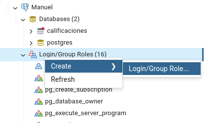
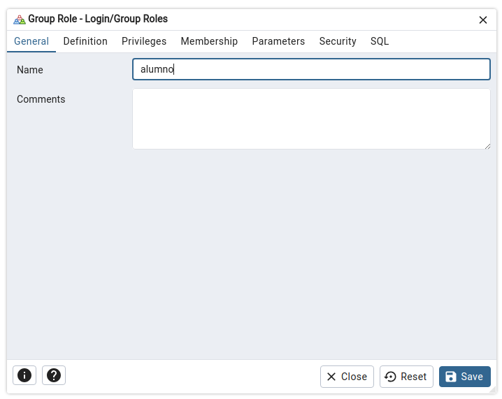
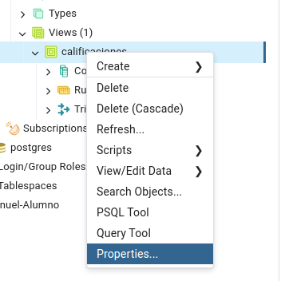
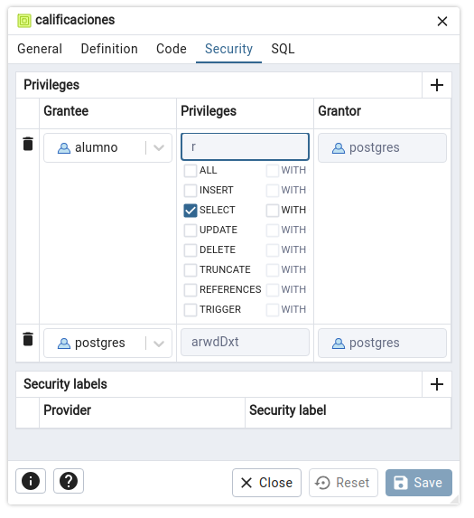

[`PostgreSQL Avanzado`](../../../README.md) > [`Sesión 06`](../../README.md) > [`Círculo de estudio`](../README.md)

#### Reto 5

##### Objetivos 🎯

- Poner en práctica la escritura de consultas e investigar nuevas técnicas.

##### Requisitos 📋

- PostgreSQL 16 instalado
- PgAdmin 4

##### Desarrollo 🚀

Vayamos a la quita parte de la solución: 

*Configura un usuario adicional a `postgres` llamado `alumno` que pueda consultar únicamente el formato de calificaciones pero no las tablas que se usan para construirlo. Para ello tendrás que darle permisos de lectura únicamente a la vista que creaste en el punto anterior.*

---
> **Paso 1.** Para crear usuarios nuevos, haremos uso de pgAdmin 4.
>
> 

Solución

>
> Comenzamos, dado clic derecho a la sección *Login/Group Roles*, elegimos Create > Login/Group Role...
>
> 
>
> Colocamos el nombre del usuario y llenamos el resto de datos del rol.
>
> 
>
> Volvemos a la sección de vistas, damos clic en la vista que creamos y elegimos Properties.
>
> 
>
> En la pestaña de Security añadimos el rol y sólo damos el permiso SELECT.
>
> 
> 

---

**¡Con esto finalizamos nuestro círculo de estudio!** :clap:

[`Anterior`](../reto04/README.md) | [`Siguiente`](../../tema01/README.md)
