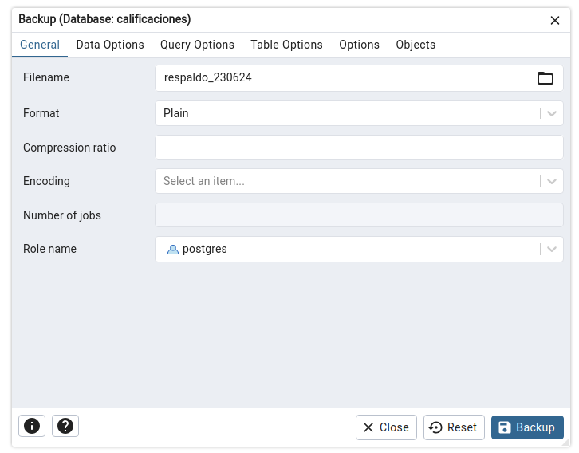

[`PostgreSQL Avanzado`](../../../README.md) > [`Sesión 06`](../../README.md) > [`Copia de Seguridad Lógica`](../README.md)

#### Ejemplo 1: Realizar una copia de seguridad lógica

1. En **PgAdmin 4**, conecta a tu servidor **PostgreSQL**.

2. Navega hasta la base de datos que deseas respaldar.

3. Haz clic derecho sobre la base de datos y selecciona "Backup...".

   

4. En la ventana de backup, selecciona el formato deseado (por ejemplo, Custom o Tar) y especifica la ubicación del archivo.

   

   

5. Haz clic en "Backup para iniciar el proceso".

6. El archivo finalizado lucirá similar a:

   

   Puedes consultarlo [aquí](../../archivos/respaldo_230624)

[`Anterior`](../README.md) | [`Siguiente`](../../tema02/README.md)
