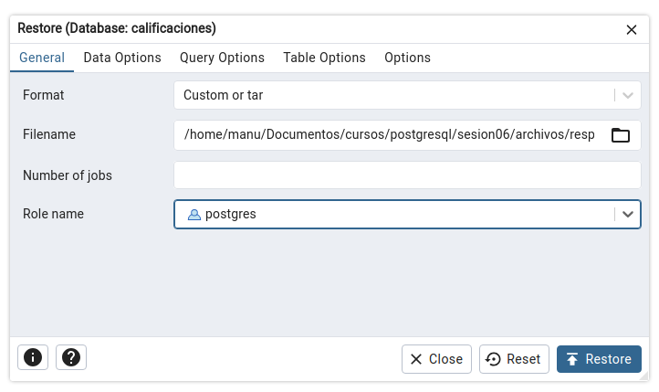

[`PostgreSQL Avanzado`](../../../README.md) > [`Sesión 06`](../../README.md) > [`Recuperación de Datos`](../README.md)

#### Ejemplo 2: Restauración de Datos

**Usando `pg_restore`**

1. En **PgAdmin 4**, conecta a tu servidor **PostgreSQL**.

2. Navega hasta la base de datos donde deseas restaurar los datos. 

3. Haz clic derecho en la base de datos y selecciona "Restore...".

4. Selecciona el archivo  de respaldo y configura las opciones de restauración según sea necesario.

  

5. Haz clic en "Restore" para iniciar el proceso.

**Usando psql**

Abre una terminal y ejecuta:

```bash
psql nombre_base_datos < backup.sql
```

##### Restauración física

La restauración física generalmente implica detener el servidor **PostgreSQL**, reemplazar el directorio de datos con la copia de seguridad y luego reiniciar el servidor. Este proceso no es soportado directamente por **PgAdmin 4**.


[`Anterior`](../../tema02/README.md) | [`Siguiente`](../../tema04/README.md)
