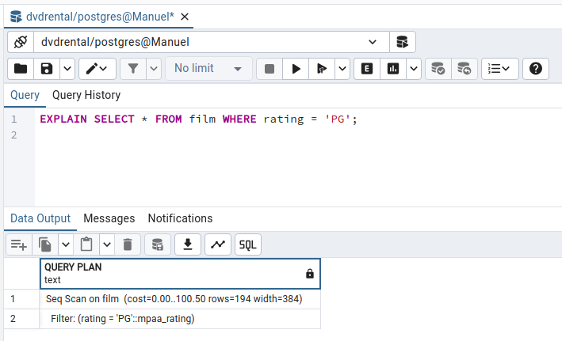
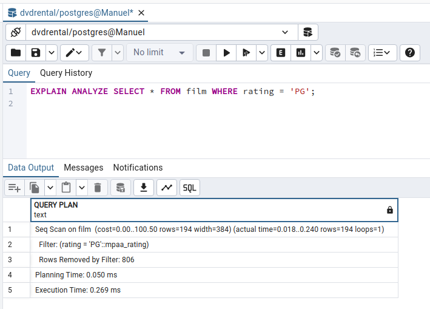
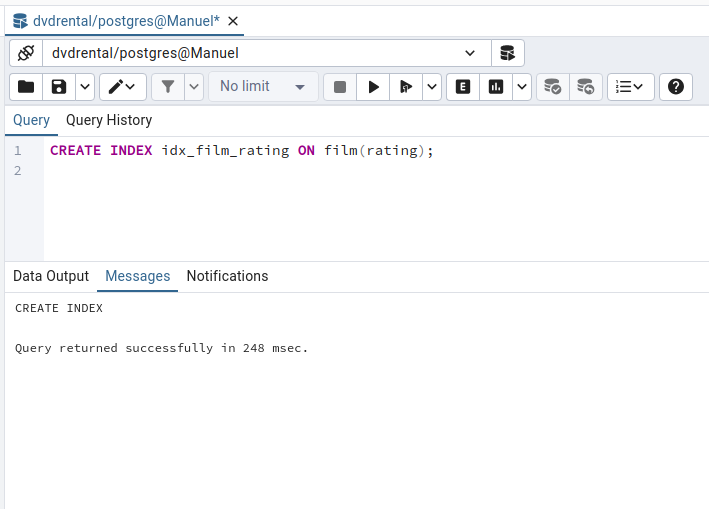
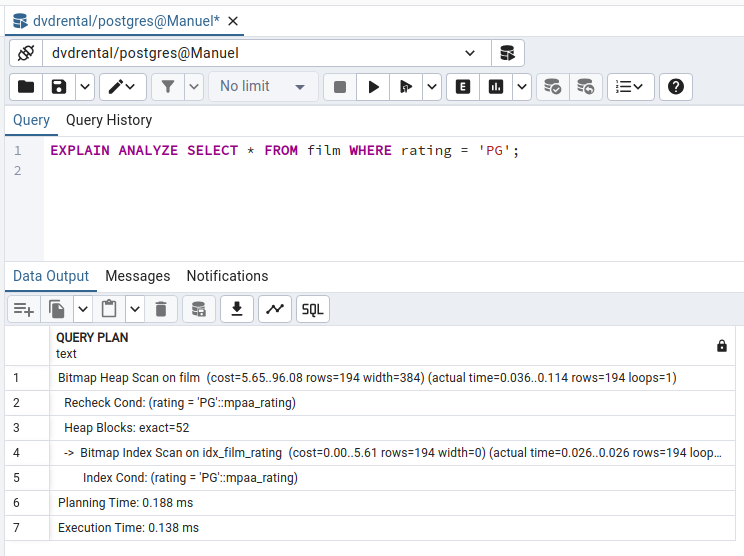
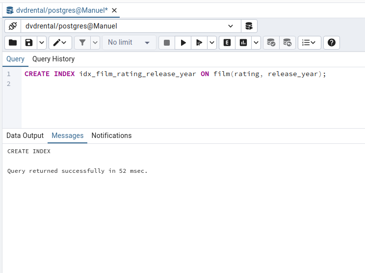
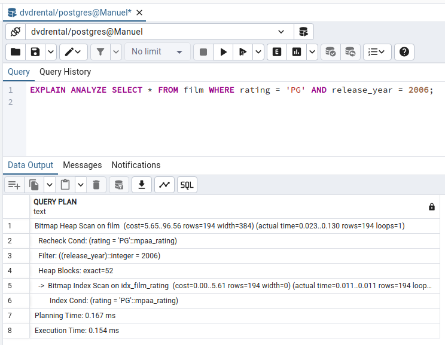
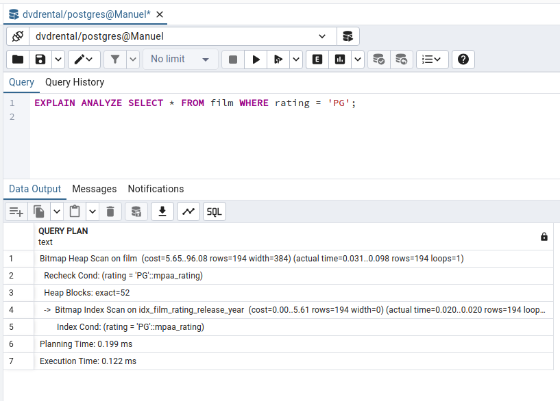
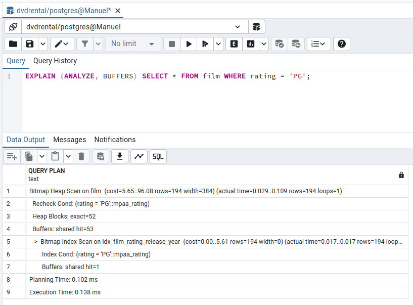

[`PostgreSQL Avanzado`](../../../README.md) > [`Sesión 07`](../../README.md) > [`Optimización de Consultas en PostgreSQL`](../README.md)

### Ejemplo 1

#### 1️⃣ Introducción

En este ejemplo, aprenderás a optimizar consultas en **PostgreSQL** mediante la interpretación de planes de ejecución, el uso adecuado de índices y la implementación de estrategias de optimización de consultas. Usaremos **pgAdmin 4** en la mayoría de ejercicios.

---

#### 2️⃣ Objetivos

1. Interpretar y utilizar el plan de ejecución de consultas.

2. Crear y utilizar índices para mejorar la velocidad de recuperación de datos.

3. Implementar estrategias de optimización de consultas en **PostgreSQL**.

---

#### 3️⃣ Prerrequisitos

- Tener **PostgreSQL** y **pgAdmin 4** instalados.

- Usaremos la base de datos "dvdreltal" que se puede descargar e instalar fácilmente desde [PostgreSQL Sample Database](https://www.postgresqltutorial.com/wp-content/uploads/2019/05/dvdrental.zip). Necesitarás poner en práctica los conceptos de la sesión pasada para restaurar la base de datos.

---

#### 4️⃣ Interpretación del Plan de Ejecución de Consultas

**Visualización del Plan de Ejecución**

1. Abre pgAdmin 4 y conéctate a tu servidor PostgreSQL.

2. Selecciona la base de datos "dvdrental".

3. Abre la herramienta de consulta (Query Tool) desde el menú superior.

4. Ejecuta la siguiente consulta y obtén el plan de ejecución.

   ```sql
   EXPLAIN SELECT * FROM film WHERE rating = 'PG';
   ```

   

5. Para obtener estadísticas del tiempo real, ejecuta:

   ```sql
   EXPLAIN ANALYZE SELECT * FROM film WHERE rating = 'PG';
   ```

   

**Interpretación del Plan**

- **Seq Scan:** Indica un escaneo secuencial de la tabla "film".

- **cost=0.00..14.90** El costo estimado de iniciar y ejecutar el plan. Es una medida relativa que utiliza el optimizador de consultas para elegir el plan de ejecución más eficiente. Este costo no está directamente relacionado con el tiempo de ejecución, sino que es una unidad arbitraria que combina varios factores como la cantidad de operaciones de E/S, y la cantidad de CPU necesaria. Piénsalo como un *score*.

- **rows=2**: Número estimado de filas que se devolverán.

- **width=99**: Tamaño promedio de las filas devueltas. 

--- 

#### 5️⃣ Uso de Índices y Optimización de Consultas

**Creación de Índices**

1. Crear un índice en la columna "rating" de la tabla "film":

   ```sql
   CREATE INDEX idx_film_rating ON film(rating);
   ```

   

2. Verifica la creación del índice y compara los planes de ejecución.

   ```sql
   EXPLAIN ANALYZE SELECT * FROM film WHERE rating = 'PG';
   ```

   

**Índices Compuestos y Parciales**

1. Crea un índice compuesto en las columnas "rating" y "release_year":

   ```sql
   CREATE INDEX idx_film_rating_release_year ON film(rating, release_year);
   ```

   

2. Ejecuta una consulta que utilice ambas columnas:

   ```sql
   EXPLAIN ANALYZE SELECT * FROM film WHERE rating = 'PG' AND release_year = 2006;
   ```

   

3. Observa el plan de ejecución para verificar el uso del índice compuesto.

4. Crea un índice parcial para optimizar consultas específicas:

   ```sql
   CREATE INDEX idx_film_rating_pg ON film(rating) WHERE rating = 'PG';
   ```

   

5. Ejecuta la consulta que utilice el índice parcial:

   ```sql
   EXPLAIN ANALYZE SELECT * FROM film WHERE rating = 'PG';
   ```

   

---

#### 6️⃣ Estrategias de Optimización de Consultas

**Reescritura de Consultas**

1. Identifica consultas que puedan beneficiarse de la reescritura. Por ejemplo, en lugar de usar una subconsulta, utiliza un `JOIN`:

   ```sql
   -- Subconsulta
   SELECT film_id, title 
   FROM film 
   WHERE film_id IN (SELECT film_id FROM inventory WHERE store_id = 1);

   -- JOIN
   SELECT f.film_id, f.title 
   FROM film f 
   JOIN inventory i 
     ON f.film_id = i.film_id 
   WHERE i.store_id = 1;
   ```

2. Compara los planes de ejecución de ambas consultas para ver la diferencia en el rendimiento.

**Uso de `EXPLAIN BUFFERS`**

1. Utiliza `EXPLAIN (ANALYZE, BUFFERS)` para obtener información detallada sobre el uso de la memoria caché:

   ```sql
   EXPLAIN (ANALYZE, BUFFERS) SELECT * FROM film WHERE rating = 'PG';
   ```

   

2. Observa y analiza los buffers utilizados durante la ejecución de la consulta.

---

#### 7️⃣ Conclusión

A través de este ejemplo, has aprendido a interpretar planes de ejecución de consultas, crear y utilizar índices, y aplicar estrategias de optimización de consultas en PostgreSQL. Utilizar estas técnicas y herramientas te permitirá mejorar significativamente el rendimiento de tus bases de datos y aplicaciones. Practica regularmente diferentes tipos de consultas y conjuntos de datos para dominar estas habilidades.

[`Anterior`](../README.md) | [`Siguiente`](../../tema02/README.md)
